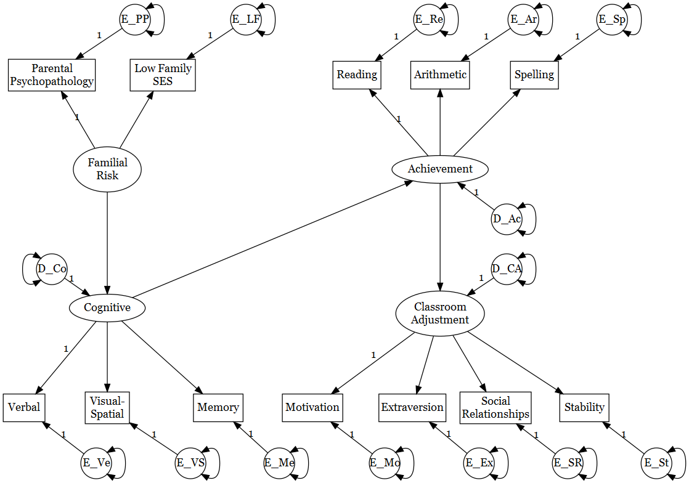

```{r setup, include=FALSE}
library(DiagrammeR)
library(DiagrammeRsvg)
library(rsvg)
```

# 4 Core SEM Techniques and Software

***
\noindent The core SEM techniques—path analysis, confirmatory factor analysis, and the evaluation of structural regression models with features of both path and factor models—are reviewed in this chapter. This presentation is based on research examples that are dealt with in more detail later in this book (Part II). Data analysis options for these examples are considered from two perspectives: first from that of standard statistical procedures, and then from that of core SEM techniques. This discussion also introduces many of the graphical elements used in model diagrams in SEM. The main goal of this discussion is to build a broader context for SEM, one that gives the reader a better sense of the connections between core SEM techniques and other analytical methods with which he or she may be more familiar. Major software tools for SEM are also described.

***

### **4.1 STEPS OF SEM**

\noindent The six basic steps of SEM are listed next. They are actually iterative because problems at a later step may require a return to an earlier one. Later chapters elaborate specific issues at each step for particular SEM techniques:


<p style="text-indent:2em">1.*Specify the model*, which means that the researcher’s hypotheses are expressed in the form of a structural equation model. Although many researchers begin the process of specification by drawing a diagram of a model using a set of more-or-less standard symbols (defined later), the model can alternatively be described as a series of equations. These equations define the model’s parameters, which correspond to presumed relations among observed or latent variables that the computer eventually estimates with sample data.</p>


<p style="text-indent:2em">2.*Determine whether the model is identified*, which means that it is theoretically possible for the computer to derive a unique estimate of every model parameter. Different types of structural equation models must meet certain requirements in order to be identified. If a model fails to meet the relevant identification requirements, attempts to estimate it may be unsuccessful.</p>


<p style="text-indent:2em">3.*Select measures* of the variables represented in the model (i.e. operationalize the constructs) and collect, prepare, and screen the data(Chapters 2–3).</p>


<p style="text-indent:2em">4.*Use a computer program to estimate the model* (i.e., conduct the analysis). Several things take place at this step:</p>
  
  a. *Evaluate model fit*, which means determine how well the model as a whole explains the data. Perhaps more often than not, researchers’ initial models do not fit the data very well. When (not if) this happens to you, go to step 5 (i.e., skip the rest of this step).
  
  b. *Interpret the parameter estimates*. Once it is determined that the fit of a structural equation model to the data is adequate, too many researchers in written summaries of the results do not interpret the parameter estimates for specific effects. It seems that the concern for overall model fit is sometimes so great that little attention is paid to whether estimates of its parameters are actually meaningful (Kaplan, 2000).
  
  c. *Consider equivalent models*. An equivalent model explains the data just as well as the researcher’s preferred model but does so with a different configuration of hypothesized relations. An equivalent model thus offers a competing account of the data. For a given structural equation model, there may be many—and in some cases infinitely many—equivalent variations; thus, it behooves the researcher to explain why his or her preferred model should not be rejected in favor of statistically equivalent ones.

<p style="text-indent:2em">5.If necessary (and it often is), *respecify the model* and evaluate the fit of the revised model to the same data. As with a model’s initial specification, its respecification should be guided by the researcher’s hypotheses.</p>

<p style="text-indent:2em">6.Given a satisfactory model, *accurately and completely describe the analysis* in written reports. MacCallum and Austin (2000) reviewed about 500 applications of SEM published in 16 different psychology research journals from 1993 to 1997. They found problems with the reporting of the results in many of these reports. For example, in about 50% of the articles, the reporting of parameter estimates was incomplete (e.g., unstandardized estimates were omitted); in about 25% it was not specified whether a covariance or correlation matrix was analyzed; and in about 10% the model specified or the indicators of latent variables were not clearly described. These are serious shortcomings, especially considering that there are published guidelines for the reporting of results in SEM (Boomsma, 2000; Hoyle & Panter, 1995; McDonald & Ho, 2002).</p>

\ 
<p style="text-indent:2em"> Two optimal steps could be added to the basic ones just described:</p>
\ 
  
<p style="text-indent:2em">7.*Replicate the results. Replication is relatively rare in SEM*. That is, models are seldom estimated across independent samples either by the same researchers who collected the original data (e.g., internal replication) or by different researchers who did not (e.g., external replication). The general need for large samples in SEM undoubtedly complicates replication. Nevertheless, it is critical to eventually replicate a structural equation model if it is ever to represent anything beyond a mere statistical exercise.</p>

<p style="text-indent:2em">8.*Apply the results*. Kaplan (2000) notes that despite more than 30 years of application of SEM in the behavioral sciences, it is rare that results from SEM analyses are used for policy or clinically relevant prediction studies. Neglecting to correctly carry out steps 4–6 may be part of the problem.</p>

<p style="text-indent:2em">The next three sections describe research examples that introduce core SEM techniques. Each example is also considered in greater detail in later chapters devoted to each technique. Do not worry that you do not now understand all of the concepts introduced here; they are dealt with in more detail later in the book.</p>

### **4.2 PATH ANALYSIS:** 
#### **A STRUCTURAL MODEL OF ILLNESS FACTORS**

\noindent D. L. Roth, Wiebe, Fillingim, and Shay (1989) administered measures of exercise, hardiness, fitness, stress, and illness within a sample of 373 university students. Hardiness refers to dispositional traits such as resiliency and willingness to look for opportunities in difficult situations. (These are also desirable attributes in those who are learning about SEM!) D. L. Roth et al. hypothesized that (1) exercise and hardiness affect fitness; (2) exercise, hardiness, and fitness affect stress; and (3) all four variables just mentioned affect illness. The variables fitness and stress are accorded special roles in these hypotheses because they are viewed as both causes and effects of other variables. However, there
was no particular hypothesis about causal relations between exercise and hardiness; that is, these variables were simply assumed to covary.


<p style="text-indent:2em">A standard statistical technique that might be used here is multiple regression. Three separate analyses might be conducted: the regression of (1) fitness on exercise and hardiness; (2) stress on exercise, hardiness, and fitness; and (3) illness on all four variables just mentioned. Each analysis would yield the R2 for each criterion and regression coefficients for each predictor. But note that fitness or stress cannot be represented in multiple regression as both a predictor and a criterion in the same analysis—each must be one or the other. Conducting three separate regression analyses would also ignore likely intercorrelations among the criterion variables, fitness, stress, and illness. The technique of canonical correlation can simultaneously analyze sets of multiple predictors and criterion variables and control for intercorrelations within each set, but the fitness or stress variables must be specified as belonging to one set or the other, not both.</p>


<p style="text-indent:2em">Path analysis (PA) from the SEM family is a possible technique when there is only a single measure of each theoretical variable and the researcher has prior hypotheses about causal relations among these
variables. The starting point is the specification of a **structural model** that represents all causal hypotheses. A **path model** is a structural model for observed variables. Consider the path model presented in Figure 4.1. This model uses symbols from an approach to causal modeling called **reticular action modeling **(RAM; e.g., McArdle & McDonald, 1984). The RAM symbolism is used in this book because it explicitly represents in diagrams every model parameter that requires a statistical estimate. This property helps to avoid mistakes when one is translating a diagram to the syntax of a particular SEM computer program.</p>

<p style="text-indent:2em">Observed variables in Figure 4.1 are represented with rectangles; in other diagrams they are also represented with squares. The variables exercise and hardiness are exogenous because their causes are unknown and thus are not represented in the model. Instead, **exogenous** variables are specified as causes of other variables. The curved line with two arrowheads ({width='30px'}) that connects the rectangles for exercise and hardiness in the figure represents the observed covariance between the two variables if they are unstandardized or their correlation if they are standardized. The same symbol also designates an **unanalyzed association** between two exogenous variables. Note that</p>

```{r fig.align='center',echo=FALSE,cache=FALSE,message=FALSE,warning=FALSE,fig.cap="**FIGURE 4.1.** A path model of illness factors."}
library(DiagrammeR)
par(mar = c(.1, .1, .1, .1))
a<-"digraph SEM {

graph [layout = neato,
       overlap = flase,
       outputorder = edgesfirst,outputorder = edgesfirst,splines=true]

node [shape = rectangle]

Exe [pos = '-4,2!', label = 'Exercise']
Har [pos = '-4,0!', label = 'Hardiness']
Fit [pos = '-1,3!', label = 'Fitness']
Str [pos = '-1,-1!', label = 'Stress']
Ill [pos = '2,1!', label = 'Illness']
D_Fi [pos = '1,4!', label = 'D_Fi', shape = circle]
D_St [pos = '1,-2!', label = 'D_St', shape = circle]
D_ll [pos = '3,2!', label = 'D_ll', shape = circle]
dummy [pos = '-4.2,1!', width=2, label='', color=white]

Exe:w->Har:w [dir = both,shape=curve]
Exe->Fit
Exe->Str
Exe->Ill
Har->Fit
Har->Str
Har->Ill
Fit->Ill
Fit->Str
Str->Ill

D_Fi->Fit [label = '1']
D_ll->Ill [label = '1']
D_St->Str [label = '1']

Exe->Exe [dir = both,tailport = 'ne', headport = 'nw']
Har->Har [dir = both,tailport = 'ne', headport = 'nw']
D_Fi->D_Fi [dir = both,tailport = 'ne', headport = 'nw']
D_ll->D_ll [dir = both,tailport = 'ne', headport = 'nw']
D_St->D_St [dir = both,tailport = 'ne', headport = 'nw']
}"
b<- grViz(a)
tmp<-capture.output(rsvg_png(charToRaw(export_svg(b)),'fig4_1.png'))

```


\noindent although such associations are estimated by the computer, they are
unanalyzed in the sense that no prediction is put forward about why
the two variables covary (e.g., does one cause the other?—do they have
a common cause?). The two-headed curved arrows in Figure 4.1 that
exit and reenter the same variable ({width='30px'}) represent the variance of an
exogenous variable. Because the causes of exogenous variables are not
represented in path models, they are typically considered free to vary
and covary. The symbols {width='30px'} and {width='30px'}, respectively, reflect these assumptions.

<p style="text-indent:2em">Each line with a single arrowhead ($\rightarrow$) in Figure 4.1 represents a
hypothesized direct effect of one variable on another. The arrowhead
points to the presumed effect and the line originates from a presumed
cause. Direct effects are also called paths, and statistical estimates of
directs effects are **path coefficients**. Path coefficients are interpreted as
regression coefficients in multiple regression, which means that they
control for correlations among multiple presumed causes of the same
variable. For example, the coefficient for the path Exercise $\rightarrow$ Fitness
in the figure controls for the correlation between exercise and hardiness.</p>

<p style="text-indent:2em">The variables fitness, stress, and illness in Figure 4.1 are all **endogenous**. Unlike exogenous variables, presumed causes of endogenous
variables are explicitly represented in the model. Observe that the
endogenous variables fitness and stress in Figure 4.1 are also specified
as direct causes of other endogenous variables (e.g., Fitness $\rightarrow$ Stress,
Stress $\rightarrow$ Illness). These specifications give fitness and stress each a
dual role as, in the language of regression, both a predictor and a criterion. This dual role is described in PA as an **indirect effect** or a **mediator effect**. Indirect effects involve one or more **intervening variables**
presumed to “transmit” some of the causal effects of prior variables
onto subsequent variables. Intervening variables in indirect effects are
also called **mediator variables**. A total of nine different indirect effects
are represented in Figure 4.1. One corresponds to the path Exercise $\rightarrow$ Fitness $\rightarrow$ Illness, and it reflects the hypothesis that exercise affects fitness, which in turn influences illness. Just as direct causal effects are
estimated in a PA, so too are indirect causal effects.</p>

<p style="text-indent:2em">Another standard feature of path models is the representation of
hypothesized spurious associations. Observe in Figure 4.1 that fitness and stress are specified to have two common causes, exercise and hardiness. The coefficient for the path Fitness$\rightarrow$Stress thus controls for these
presumed common causes. Like a partial correlation, if the value of this
coefficient is close to zero, the observed correlation between fitness and
stress may reflect solely a spurious association. However, if this coefficient is substantial, the hypothesis of spuriousness is rejected. Together
with the ability to estimate direct and indirect effects and to control for
correlations among presumed causal variables, PA can be seen as a way to
“decompose” observed correlations into their constituent parts, spurious
and nonspurious (causal). A path model is said to fit the data if these
decompositions can reproduce the observed correlations.</p>

<p style="text-indent:2em">Circles or ellipses in diagrams of structural equation models usually represent unobserved or latent variables. These variables in path
models are **disturbances**, and every endogenous variable has a disturbance. In Figure 4.1, disturbances are represented with an uppercase $D$.
For example, the term $D_{Fi}$ represents variance in fitness unexplained by
the variables specified as its direct causes, exercise and hardiness; the
other two disturbances in Figure 4.1 have similar interpretations. Disturbances are analogous to residuals in regression but have a connotation based more in causal modeling than just prediction. Theoretically,
disturbances represent all causes of an endogenous variable that are
omitted from the structural model. For example, there are almost certainly things that affect stress besides exercise, hardiness, and fitness:
factors such as coping mechanisms or genetic predispositions, among
others, quickly spring to mind. A disturbance can be seen as a “proxy”
or composite variable that represents all unmeasured causes, and the
line that points from a disturbance to an endogenous variable represents the combined effects of all the omitted causes of that variable.
Because the nature and number of these omitted causes is unknown as
far as the model is concerned, disturbances can be viewed as unmeasured exogenous variables. For this reason, the symbol for the variance
of an exogenous variable ( {width='30px'} ) appears next to each disturbance in Figure 4.1. The constants (1.0) that appear in the figure next to the paths
from disturbances to endogenous variables represent the assignment of
a scale (metric) to each unobserved exogenous variable. The concept
behind this specification is explained in the next chapter. Analysis of
the path model in Figure 4.1 is discussed in Chapter 6.</p>

### **4.3 CONFIRMATORY FACTOR ANALYSIS:** 
#### **A MEASUREMENT MODEL OF AROUSAL**

\noindent The Visual Similes Test II (VST II; Eaves, 1995) is intended to measure
levels of arousal among persons ages 5–21 years. It consists of two
forms, Affective and Cognitive. Items for both forms consist of visual
stimuli where a checkerboard pattern obscures 50% of the image:
Affective form items (30 in total) are pictures that depict scenes related
to survival, such as predation and disasters, but Cognitive form items
(25 in total) depict stimuli that require abstractions in order to interpret them (e.g., a picture of the American flag should be recognized as
that nation’s flag by children in the United States). Examinees are to
correctly identify each picture within 60 seconds. T. O. Williams,
Eaves, and Cox (2002) administered the VST II to 216 children ages
10–12 years old, and they created 10 different item parcels, 5 for each
form. A parcel is a total score across a group of homogeneous items and
is usually considered a continuous variable. (The analysis of item parcels is discussed in more detail in Chapter 7.)

<p style="text-indent:2em">T. O. Williams et al. (2002) used the technique of confirmatory
factor analysis (CFA) from the SEM family to evaluate whether the 10
different item parcels of the VST II seem to measure two distinct factors
that may correspond to affective arousal and cognitive arousal. As concisely defined by Nunnally and Bernstein (1994, p. 85), a construct</p>
  
  *reflects the hypothesis (often incompletely formed) that a variety of behaviors will correlate with one another in studies of individual differences and/or will be similarly affected by experimental manipulation*
  
\noindent Hypothetical constructs are not directly observable. Instead, they can
be only inferred or measured indirectly through observed variables,
also called **indicators**. For two reasons, it is probably unrealistic to
expect that a hypothetical construct could be adequately measured by
any single indicator. First, indicators are not generally free from the
effects of random error, which implies that their scores are not perfectly
reliable. Second, not all of the systematic part of an indicator’s variance
may reflect the construct that the researcher wishes to assess (e.g., self-reports may be susceptible to a response set), which implies that the
scores are not perfectly valid.

<p style="text-indent:2em">One way around the aforementioned problems of measuring a construct with a single indicator is to use multiple indicators. Scores across
a set of measures tend to be more reliable and valid than scores on any
individual measure. Also, multiple indicators may each assess a somewhat different facet of the construct, which enhances score validity.
However, multiple indicators of every construct are not always available; if so, the researcher must settle for single-indicator measurement.
Obviously, it is crucial that a single indicator have good psychometric
characteristics. Either multiple- or single-indicator measurement can
be represented in SEM, but path analysis assumes only the latter (see
Figure 4.1).</p>

<p style="text-indent:2em">A standard statistical technique for evaluating a measurement
model is **exploratory factor analysis** (EFA). Originally developed by
psychologists to test theories of intelligence, EFA is not generally considered a member of the SEM family. The term EFA actually refers to a
class of procedures that include centroid, principal components, and
principal axis factor analysis, among many others, that differ in the statistical criteria used to derive factors. As its name suggests, EFA does
not require a priori hypotheses about how indicators are related to
underlying factors or even the number of factors. For example, all of
the indicators are typically allowed to correlate with every factor in
EFA. Hence the term “exploratory,” which in this context means that
the researcher has little direct influence on the correspondence
between indicators and factors. There are ways to conduct EFA in a
more confirmatory mode, such as when the computer is instructed to
extract a certain number of factors based on theory, but the point is that
EFA does not require specific hypotheses in order to apply it. Fabrigar,
Wegener, McCallum, and Strahan (1999) evaluate the use of EFA in
psychological research.</p>


<p style="text-indent:2em">The technique of CFA analyzes a priori measurement models in
which both the number of factors and their correspondence to the indicators are explicitly specified. Presented in Figure 4.2 is a two-factor
CFA measurement model of the VST II analyzed by T. O. Williams et al.
(2002). The two factors in this model, Affective Arousal and Cognitive
Arousal, are each represented by a symbol for a latent variable, an
ellipse; in other diagrams, factors are also represented with circles. The
curved line that connects the ellipses in the figure ({width='30px'}) has the same
meaning as in PA in that it designates an unanalyzed association. Here,</p>

```{r fig.align='center',fig.show='hide',echo=FALSE,cache=FALSE,message=FALSE,warning=FALSE}
library(DiagrammeR)
par(mar=c(0,0,0,0))
a42<-grViz("
digraph SEM {
graph [layout = neato, overlap = FALSE, outputorder = edgesfirst,splines=true]
node [shape = square]

E_A1 [pos = '-4,3!', label = 'E_A1', shape = circle,fixedsize = true,width = 0.55]
E_A2 [pos = '-3,3!', label = 'E_A2', shape = circle,fixedsize = true,width = 0.55]
E_A3 [pos = '-2,3!', label = 'E_A3', shape = circle,fixedsize = true,width = 0.55]
E_A4 [pos = '-1,3!', label = 'E_A4', shape = circle,fixedsize = true,width = 0.55]
E_A5 [pos = '0,3!', label = 'E_A5', shape = circle,fixedsize = true,width = 0.55]
E_C1 [pos = '2,3!', label = 'E_C1', shape = circle,fixedsize = true,width = 0.55]
E_C2 [pos = '3,3!', label = 'E_C2', shape = circle,fixedsize = true,width = 0.55]
E_C3 [pos = '4,3!', label = 'E_C3', shape = circle,fixedsize = true,width = 0.55]
E_C4 [pos = '5,3!', label = 'E_C4', shape = circle,fixedsize = true,width = 0.55]
E_C5 [pos = '6,3!', label = 'E_C5', shape = circle,fixedsize = true,width = 0.55]
A1 [pos = '-5,2!', label = 'A1']
A2 [pos = '-4,2!', label = 'A2']
A3 [pos = '-3,2!', label = 'A3']
A4 [pos = '-2,2!', label = 'A4']
A5 [pos = '-1,2!', label = 'A5']
C1 [pos = '1,2!', label = 'C1']
C2 [pos = '2,2!', label = 'C2']
C3 [pos = '3,2!', label = 'C3']
C4 [pos = '4,2!', label = 'C4']
C5 [pos = '5,2!', label = 'C5']

Aff [pos = '-3,0!', label = 'Affective\n Arousal', shape = ellipse]
Cog  [pos = '3,0!', label = 'Cognitive\n Arousal', shape = ellipse]
dummy [pos = '0,-0.1!', height=1.5, label='', color=white]

E_A1 -> E_A1 [dir = both, tailport = 'ne', headport = 'nw']
E_A2 -> E_A2 [dir = both, tailport = 'ne', headport = 'nw']
E_A3 -> E_A3 [dir = both, tailport = 'ne', headport = 'nw']
E_A4 -> E_A4 [dir = both, tailport = 'ne', headport = 'nw']
E_A5 -> E_A5 [dir = both, tailport = 'ne', headport = 'nw']
E_C1 -> E_C1 [dir = both, tailport = 'ne', headport = 'nw']
E_C2 -> E_C2 [dir = both, tailport = 'ne', headport = 'nw']
E_C3 -> E_C3 [dir = both, tailport = 'ne', headport = 'nw']
E_C4 -> E_C4 [dir = both, tailport = 'ne', headport = 'nw']
E_C5 -> E_C5 [dir = both, tailport = 'ne', headport = 'nw']

Aff->Aff[dir = both, tailport = 'sw', headport = 'nw']
Cog ->Cog[dir = both, tailport = 'se', headport = 'ne']

E_A1 -> A1[label='1']
E_A2 -> A2[label='1']
E_A3 -> A3[label='1']
E_A4 -> A4[label='1']
E_A5 -> A5[label='1']
E_C1 -> C1[label='1']
E_C2 -> C2[label='1']
E_C3 -> C3[label='1']
E_C4 -> C4[label='1']
E_C5 -> C5[label='1']
Aff-> A1[label='1']
Aff-> A2
Aff-> A3
Aff-> A4
Aff-> A5
Cog-> C1[label='1']
Cog-> C2
Cog-> C3
Cog-> C4
Cog-> C5
Cog-> Aff[dir=both,tailport = 's', headport = 's'];

}
")
tmp<-capture.output(rsvg_png(charToRaw(export_svg(a42)),'fig4_2.png'))

```


\noindent there is no hypothesis that one of these factors causes the other;
instead, they are simply assumed to covary. In this way, the two factors
in Figure 4.1 are exogenous variables, but ones that are not directly
measured. Because the factors are exogenous, the symbol for a variance
({width='30px'}) appears next to each of them in Figure 4.2.

<p style="text-indent:2em">The 10 different item parcels of the VST II (5 per scale) analyzed
by T. O. Williams et al. (2002) are represented in Figure 4.2 with the
symbol for an observed variable, a square. Analogous to their counterparts in PA are the paths in the figure that point from the factors to the
indicators, which represent direct effects—but here of the factors on
the indicators. Conceptually, these paths represent causal effects of the
factor on an indicator, that is, the extent to which the factor is reflected
in the scores of that indicator. In this sense, a measurement model can
be viewed as a structural model of presumed causal effects of latent
variables on observed scores. Whereas statistical estimates of direct
effects in PA are called path coefficients, the corresponding term in factor analysis for such estimates is **factor loading**. In CFA, factor loadings
are usually interpreted as regression coefficients that may be in standardized or unstandardized form. In some cases (defined in Chapter 7),
standardized factor loadings can be interpreted as estimated Pearson
correlations between an indicator and a factor. One of these cases is
when an indicator is specified to reflect (measure, load on) a single factor and its measurement error term is unrelated to those of all other
indicators. This description corresponds to the measurement model of Figure 4.2. But in other cases, these coefficients in standardized form
are interpreted as standardized regression weights (i.e., beta weights).
The constants (1.0) that appear in Figure 4.2 next to the paths from the
factors to just one of their indicators (e.g., Affective $\rightarrow$ A1) represent
the assignment of a metric to the factors. The scaling of factors in CFA
measurement models is discussed in Chapter 7.</p>

<p style="text-indent:2em">Each term in Figure 4.2 designated with an uppercase $E$ is a **measurement error**, which represents **unique variance**, a factor-analytic
term for indicator variance not explained by the factors. Like disturbances in path models, measurement errors are proxy variables for all
sources of residual variation in indicator scores that is not explained by
the factors; that is, they are unmeasured exogenous variables. Accordingly, the symbol for a variance ({width='30px'}) appears next to each of the measurement error terms in Figure 4.2. Two types of unique variance are
represented by measurement error terms: random error (score unreliability) and all sources of systematic variance not due to the factors.
Examples of the latter include effects due to a particular measurement
method or the particular stimuli that make up a task. When it is said
that SEM takes account of measurement error, it is the E terms to
which this statement refers, although E terms reflect more than just
score unreliability. The paths in the figure that point to the indicators
from the measurement errors represent the direct effects of all unmeasured sources of unique variance on the indicators. The constants (1.0)
that appear in Figure 4.2 next to these paths represent the assignment
of a metric to each residual term.</p>

<p style="text-indent:2em">The results of a CFA include estimates of covariances between the
factors, loadings of the indicators on their respective factors, and the
amount of measurement error (unique variance) for each indicator. If
the researcher’s a priori measurement model is reasonably correct, then
one should see the following pattern of results: (1) indicators specified
to measure a common underlying factor all have relatively high standardized loadings on that factor, and (2) estimated correlations
between the factors are not excessively high (e.g., >.85). The former
result indicates convergent validity; the latter, discriminant validity. For
example, if the estimated correlation between the Affective Arousal and
the Cognitive Arousal factors in the model of Figure 4.2 is .95, then the
10 indicators can hardly be said to measure two distinct constructs. If
the results of a CFA do not support the researcher’s a priori hypotheses, the measurement model can be respecified and reanalyzed. The ideas of
convergent validity and discriminant validity are discussed in more
detail later in this book. The analysis of the CFA measurement model
in Figure 4.2 is considered in Chapter 7.</p>
### **4.4 A STRUCTURAL REGRESSION MODEL OF FAMILY RISK AND CHILD ADJUSTMENT** 

\noindent The most general kind of basic structural equation model is a structural
regression (SR) model, also called a hybrid model or a LISREL model.
The last term reflects the fact that LISREL was one of the first computer
programs to analyze SR models, but essentially any contemporary SEM
computer program can do so now. An SR model is the synthesis of a
structural model and a measurement model. As in PA, the specification
of an SR model allows tests of hypotheses about direct and indirect
causal effects. Unlike path models, though, these effects can involve
latent variables because an SR model also incorporates a measurement
component that represents observed variables as indicators of underlying factors, just as in CFA. The capability to test hypotheses about both
structural and measurement relations within a single model affords
much flexibility.

<p style="text-indent:2em">Worland, Weeks, Janes, and Strock (1984) measured within a sample of 158 adolescents the degree of parental psychopathology (none,
schizophrenia or affective disorder, other psychiatric or medical disorder) and low family socioeconomic status (SES). The cognitive status
of the adolescents was assessed with an IQ test that yielded standard
scores in three areas: verbal ability, visual–spatial ability, and short-term
memory ability. Their scholastic skills were measured with other standardized tests of reading, arithmetic, and spelling. Finally, the adolescents’ teachers completed rating scales about classroom adjustment in
four areas: motivation, extraversion, social relationships, and emotional stability. Worland et al. (1984) hypothesized that greater familial
risk as indicated by the presence of significant parent psychopathology
and low family SES affects classroom adjustment only indirectly, first
through cognitive ability and then through scholastic achievement
(i.e., high familial risk $\rightarrow$ low ability $\rightarrow$ poor achievement $\rightarrow$ problematic classroom adjustment).</p>

<p style="text-indent:2em">Worland and colleagues’ use of multiple measures of each domain
implies a measurement model—here, one with four factors each
assessed with either two (familial risk), three (cognitive ability,
achievement), or four (classroom adjustment) indicators. Using CFA,
one could test whether the 12 indicators in this study indeed seem to
measure four factors. Results of a CFA would also yield estimates of
correlations among these four factors. However, Worland et al. (1984)
did not simply assume that these four factors are correlated. Instead,
they hypothesized a specific pattern of direct and indirect causal relations among them. The technique of CFA estimates only unanalyzed
associations among factors, not direct causal effects. Presumed causal
effects can be specified and tested in PA, but this technique analyzes
observed variables, not latent variables that correspond to hypothetical
constructs.</p>

<p style="text-indent:2em">What is needed here is an analytic approach that combines features
of both CFA and PA. It is possible in SEM to specify an SR model that
has a structural component (like a path model) and a measurement
component (like a factor model). Consider the model presented in Figure 4.3 specified to reflect Worland and colleagues’ hypotheses (1984).
The measurement part of this SR model concerns an a priori pattern of
loadings of the indicators on the factors, just as in a CFA model. The
structural portion of the model involves direct effects among the four
latent variables. Here, the familial risk factor is specified as exogenous
and the other three factors as endogenous. The cognitive ability factor
is specified to mediate the effects of the familial risk factor on the scholastic achievement factor, which in turn mediates the effect of the cognitive ability factor on the classroom adjustment factor, just as hypothesized by Worland et al. (1984). The evaluation of an SR model is thus
akin to conducting a PA but among factors instead of observed variables.</p>

<p style="text-indent:2em">Note another feature of the SR model in Figure 4.3: it has both
measurement errors and disturbances. Each indicator in the model has
its own measurement error term, just as in a CFA model. Like a path
model, the endogenous factors in Figure 4.3 each have a disturbance,
but these disturbances reflect omitted causes of latent rather than
observed variables. The representation of both kinds of residual terms
in an SR model allows measurement error in the indicators to be estimated apart from direct or indirect causal effects among the factors. In contrast, estimation of structural relations in path models, which do
not have factors and thus no measurement error terms (see Figure 4.1),
does not control for measurement error. The ability to do so with an SR
model in the evaluation of presumed causal relations is thus an important advantage over a path model. Analysis of the SR model in Figure
4.3 is discussed in Chapter 8.</p>

```{r fig.align='center',echo=FALSE,cache=FALSE,message=FALSE,warning=FALSE}
library(DiagrammeR)
par(mar=c(0,0,0,0))
a43<-grViz("
digraph SEM {
graph [layout = neato, overlap = FALSE, outputorder = edgesfirst]
node [shape = rectangular]

pp  [pos = '1.5,8!', label = 'Parental\nPsychopathology']
lfs [pos = '3.5,8!', label = 'Low Family\n SES']
read[pos = '7,8!', label = 'Reading']
ari [pos = '8.5,8!', label = 'Arithmetic']
spell [pos = '10.2,8!', label = 'Spelling']

ver[pos ='1,2!', label = 'Verbal']
vs [pos = '2.5,2!', label = 'Visual-\nSpatial']
mem[pos = '4.5,2!', label = 'Memory']
mot[pos = '6.2,2!', label = 'Motivation']
ext[pos = '8,2!', label = 'Extraversion']
sr [pos = '9.5,2!', label = 'Social\nRelationships']
sta[pos = '11.1,2!', label = 'Stability']

E_PP [pos = '3,9!', shape = circle,fixedsize = true,width = 0.55]
E_LF [pos = '5,9!', shape = circle,fixedsize = true,width = 0.55]
E_Re [pos = '8.3,9!', shape = circle,fixedsize = true,width = 0.55]
E_Ar [pos = '10,9!', shape = circle,fixedsize = true,width = 0.55]
E_Sp [pos = '11.6,9!', shape = circle,fixedsize = true,width = 0.55]

D_Co [pos = '1.5,4.5!', shape = circle,fixedsize = true,width = 0.55]
D_Ac [pos = '9.7,5.4!', shape = circle,fixedsize = true,width = 0.55]
D_CA [pos = '9.7,4.5!', shape = circle,fixedsize = true,width = 0.55]

E_Ve [pos = '2.3,1!',  shape = circle,fixedsize = true,width = 0.55]
E_VS [pos = '4,1!',  shape = circle,fixedsize = true,width = 0.55]
E_Me [pos = '5.6,1!', shape = circle,fixedsize = true,width = 0.55]
E_Mo [pos = '7.5,1!',  shape = circle,fixedsize = true,width = 0.55]
E_Ex [pos = '9.2,1!',  shape = circle,fixedsize = true,width = 0.55]
E_SR [pos = '10.8,1!', shape = circle,fixedsize = true,width = 0.55]
E_St [pos = '12.4,1!',  shape = circle,fixedsize = true,width = 0.55]

fr [pos = '2.5,6.3!', label = 'Familial\n Risk', shape = ellipse]
ach[pos = '8.5,6.3!', label = 'Achievement', shape = ellipse]
cog[pos = '2.5,3.8!', label = 'Cognitive', shape = ellipse]
ca [pos = '8.5,3.7!', label = 'Classroom\nAdjustment', shape = ellipse]
fr->cog
cog->ach
ach->ca
E_PP -> pp[label='1']
E_LF -> lfs[label='1']
E_Re -> read[label='1']
E_Ar -> ari [label='1']
E_Sp -> spell [label='1']
E_Ve -> ver[label='1']
E_VS -> vs [label='1']
E_Me -> mem[label='1']
E_Mo -> mot[label='1']
E_Ex -> ext[label='1']
E_SR -> sr [label='1']
E_St -> sta[label='1']
D_Co -> cog [label='1']
D_Ac -> ach[label='1']
D_CA -> ca [label='1']

fr->pp[label='1']
fr->lfs
ach->read[label='1']
ach->{ari,spell}
cog->ver[label='1']
cog->{vs,mem}
ca->mot[label='1']
ca->{ext,sr,sta}
E_PP -> E_PP [dir = both, tailport = 'ne', headport = 'se']
E_LF -> E_LF [dir = both, tailport = 'ne', headport = 'se']
E_Re -> E_Re [dir = both, tailport = 'ne', headport = 'se']
E_Ar -> E_Ar [dir = both, tailport = 'ne', headport = 'se']
E_Sp -> E_Sp [dir = both, tailport = 'ne', headport = 'se']
E_Ve -> E_Ve [dir = both, tailport = 'ne', headport = 'se']
E_VS -> E_VS [dir = both, tailport = 'ne', headport = 'se']
E_Me -> E_Me [dir = both, tailport = 'ne', headport = 'se']
E_Mo -> E_Mo [dir = both, tailport = 'ne', headport = 'se']
E_Ex -> E_Ex [dir = both, tailport = 'ne', headport = 'se']
E_SR -> E_SR [dir = both, tailport = 'ne', headport = 'se']
E_St -> E_St [dir = both, tailport = 'ne', headport = 'se']
D_Co -> D_Co [dir = both, tailport = 'nw', headport = 'sw']
D_Ac -> D_Ac [dir = both, tailport = 'ne', headport = 'se']
D_CA -> D_CA [dir = both, tailport = 'ne', headport = 'se']

}
")
tmp<-capture.output(rsvg_png(charToRaw(export_svg(a43)),'fig4_3.png'))

```


\noindent contrast, estimation of structural relations in path models, which do
not have factors and thus no measurement error terms (see Figure 4.1),
does not control for measurement error. The ability to do so with an SR
model in the evaluation of presumed causal relations is thus an important advantage over a path model. Analysis of the SR model in Figure
4.3 is discussed in Chapter 8.

### **4.5 EXTENSIONS** 

\noindent As demonstrated in Part II of this book, path, CFA measurement, or SR
models can be specified to test a wide variety of hypotheses about how
variables are presumed to relate to each other. All of these core kinds of
models have just a covariance structure, which includes a structural
model or a measurement model (or both). Models with a covariance
structure are estimated with sample covariances (or the raw scores).
Discussed in Part III of this book are ways that these core models can
be extended to represent additional kinds of statistical effects. For
example, it is possible to add a mean structure to the basic covariance
structure of just about any kind of structural equation model. A latent
growth model, among other kinds of models that represent means, is
basically an SR model with a mean structure (Chapter 10). Unlike standard statistical techniques—such as the analysis of variance
(ANOVA)—that analyze only means of observed variables, means of
latent variables can also be estimated in SEM taking account of error in
the indicators. Models with mean structures are estimated with sample
covariances and means (or the raw scores). The ability to analyze basically any kind of structural equation model across multiple samples
further extends the range of hypotheses that can be tested in SEM
(Chapter 11). For example, group differences on latent variable means
can be estimated when a model with a mean structure is simultaneously estimated across multiple samples.

### **4.6 SEM COMPUTER PROGRAMS** 

\noindent Described next are characteristics of the most widely used computer programs for SEM and ways of using them.

#### **Human–Computer Interaction**\

There are now several different computer programs for SEM that run
on personal computers. There are basically three ways to specify models in these programs. The first is batch mode, which is for users who
already know a program’s syntax. Lines of code that describe the
model, data, and analysis are entered directly into an editor window
that may be saved as an ASCII (text) file. Program code entered directly
by the user this way is then executed through some form of a “run”
command, and the output appears in a new window or is saved in a
separate file. Virtually all SEM computer programs support batch
mode. The two other ways to specify the model do not require knowledge of program syntax, but they are not available in all SEM computer
programs. One method uses “wizards,” which are series of templates
(dialog boxes) that build the model, data, or analysis, which is done by
the user clicking with the mouse cursor on graphical user interface
(GUI) elements such as text fields, check boxes, or buttons. Once the
wizard has all the information, it automatically writes the program
code, which can then be run. Another method provides a GUI through
which the user conducts an analysis by drawing the model on the
screen. The user is typically provided with a palette of tools in a graphical editor for drawing the model using the symbols described earlier.
Some drawing editors attempt to prevent the user from making illegal
specifications with the drawing tools such as associating a disturbance
with an exogenous variable. When the diagram is finished, the analysis
is run from within the program’s GUI.

<p style="text-indent:2em">Specifying a structural equation model by drawing it on the screen
allows beginners to be productive right away. However, there are some
drawbacks to working this way. It can be quite tedious to specify a
complex model in a drawing editor, and it is even more tedious to generate a diagram of publication quality. (This is true in any drawing program though.) In fact, it can sometimes be easier to specify a relatively
complicated model through a wizard that presents a series of templates.
Conducting multiple-sample analyses through a drawing editor can
also be awkward, especially if there are more than two groups. This is
because it may be necessary to look through several different screens or
windows to get all the information about model specifications and data
for each group. As users become more familiar with the program, they may find it is more efficient to specify the model by writing code themselves and working in batch mode. For example, all program code for a
multiple-sample analysis in batch mode is usually placed in one file,
which eliminates the need to look through different windows in a
drawing editor to verify whether model specification is correct.</p>

#### **Individual Programs** \

A total of eight different SEM computer programs for personal computers are briefly described next. Listed alphabetically, they include Amos,
the CALIS procedure of SAS/STAT, EQS, LISREL, Mplus, Mx Graph,
the RAMONA module of SYSTAT, and the SEPATH module of
STATISTICA. There are free student versions of some of the programs
just mentioned that place a limit on the size of model or number of
variables that can be analyzed. And one of the programs, Mx Graph, is
available at no cost because it is not a commercial product. There are
other software programs that can analyze structural equation models,
but they are not used as often as those listed above.

<p style="text-indent:2em">The programs described next can analyze all of the core types of
structural equation models discussed earlier. Most of these programs
can also analyze means or models across multiple samples. They differ
mainly in their support for more advanced types of analyses and ways
of interacting with the program. The descriptions that follow emphasize the major features and relatively unique characteristics of each
program. Because specific features or capabilities of computer programs can change quickly when new versions are released, readers
should refer to the Web sites listed here for the most recent information. Presented as appendixes in later chapters are examples of syntax
from most of these programs applied to various research examples.</p>

#### **Amos**[^1] \

[^1]: www.smallwaters.com

Version 5 of Amos (Analysis of Moment Structures; Arbuckle, 2003) is a
Microsoft Windows program made up of two core modules, Amos
Graphics and Amos Basic. Amos Graphics provides a GUI through which
the user can specify the model by drawing it on the screen. All other
aspects of the analysis are also controlled through this GUI. A complete set of tools is available under Amos Graphics for drawing, modifying, or
aligning graphical elements of model diagrams. Amos Graphics attempts
to prevent mistakes in model specification. For example, it does not
allow the user to connect two endogenous variables with {width='30px'}, the symbol
for an unanalyzed association between two exogenous variables. A set of
preprogrammed graphical dialogs (wizards) is also available that automatically draw covariances among a set of exogenous variables, resize the
squares or rectangles that represent observed variables, or draw an entire
latent growth model, among other tasks.

<p style="text-indent:2em">If the analysis terminates normally, Amos Graphics can display
either the unstandardized or standardized estimates in their proper
places in the model diagram. A special utility is the Amos Modeling
Laboratory, in which the user can select an individual parameter,
change its value, and observe how this change affects model fit. Amos
Graphics also has extensive capabilities for more exploratory analyses.
For example, the Specification Search function allows the user to designate particular paths in the model diagram as optional. The Amos program then fits the model to the data, using every possible subset of
optional paths. The resulting candidate models can be sorted by values
of various statistics that measure the fit of the model to the data.</p>

<p style="text-indent:2em">Amos Basic works in batch mode, which means that the model
and data are specified in Amos’s text-based syntax before all statements are run to execute the analysis. Amos Basic syntax is quite
flexible in that it does not use a fixed set of symbols to designate
things such as observed versus latent variables or disturbances.
Instead, labels for all variables are supplied by the user. Amos Basic is
also a full-featured Microsoft Visual Basic language interpreter. This
means that it is possible in Amos Basic to write, compile, and debug
scripts for Microsoft Visual Basic that control or modify the functionality of Amos Graphics.</p>

<p style="text-indent:2em">Other special features of Amos include the capability to generate
bootstrapped estimates of standard errors and confidence intervals for
all parameter estimates. Both nonparametric bootstrapping (when a
raw data file is analyzed) and parametric bootstrapping that assumes
multivariate normality (when a matrix summary of the data is analyzed) are available in Amos. The program also offers a special maximum likelihood method for raw data files where some observations are
missing at random.</p>

#### **CALIS**[^2] \

[^2]: www.sas.com/technologies/analytics/statistics/stat/index.html

The CALIS (Covariance Analysis and Linear Structural Equations) procedure of SAS/STAT 8, a comprehensive software package for general
statistical analysis that runs under Microsoft Windows (SAS Institute
Inc., 2000), analyzes a wide variety of structural equation models. It
can also estimate parameters in analyses such as multiple or
multivariate linear regression. The CALIS procedure runs only in batch
mode; that is, the user must type commands in an editor window that
describe the data and model and then run the program in the SAS environment. Models can be specified in CALIS using one of four different
representational notations, including LISREL-type matrix-based syntax, EQS-type equations-based syntax, the matrix representational system of the McArdle–McDonald RAM approach, or the matrix-based
syntax used in an older SEM program for Microsoft DOS called COSAN
(Covariance Structure Analysis; Fraser, 1990).[^3]  A person familiar with
any one of these representational notations should be able to specify
structural equation models in CALIS without much difficulty.


[^3]: COSAN can be freely downloaded from the Web site of the Jefferson Psychometric
Laboratory (Department of Psychology, University of Virginia) at kiptron.psyc.virginia.
edu/Programs/software.html

<p style="text-indent:2em">Many statistical aspects of the analysis can be controlled through options in CALIS. For example, the user can select among four different methods for calculating start values (initial estimates of model parameters; Chapter 5). Several other options control the estimation process, such as the particular statistical search method used to find optimal parameter estimates. Output from one analysis in CALIS can be automatically saved for input into the next run of the program for the same model and data. This capability can be handy for checking whether a model is identified. (This point is elaborated in later chapters.) However, multiple-sample analyses in CALIS are limited to cases
where the sizes of all groups are equal.</p>

#### **EQS**[^4] \

[^4]: www.mvsoft.com

Version 6 of EQS (Equations; Bentler, 2003) is a Microsoft Windows
program that can be used for all stages of the analysis from data entry and screening to exploratory statistical analyses to SEM. The EQS data
editor has many of the capabilities of a general statistical package,
including conditional case selection, variable transformation, merging
of separate data files, and the coding of missing values. Data can be displayed in several different kinds of graphical charts or plots, such as
histograms, bar charts, scatterplots, and boxplots, among other types.
Exploratory statistical analyses that can be conducted in EQS include
the calculation of descriptive statistics, the t test, the analysis of variance (ANOVA) for one-way or factorial designs with or without
covariates, multiple regression, nonparametric statistics, exploratory
factor analysis, and intraclass correlation. There are also options for the
analysis of missing data patterns and mean-, regression-, or modelbased imputation of missing observations.

<p style="text-indent:2em">The user can interact with EQS in three different ways: in batch
mode, through wizards that collect information about the model and
data and automatically write EQS programming syntax, or through a
drawing editor. The latter two ways do not require knowledge of EQS
syntax. The drawing editor in EQS is its Diagrammer, which offers
graphical tools for drawing the model on the screen. Tools available in
the Diagrammer can automatically draw an entire path, factor, or latent
growth curve model after the user completes a few templates about the
variables, direct effects, measurement occasions, or residual terms. Like
Amos Graphics, the EQS Diagrammer attempts to prevent the user
from making illegal specifications with its drawing tools. The second
way to specify a model in EQS is to bypass the Diagrammer and use the
templates available under the “Build_EQS” menu, which prompt the
user to enter information about the analysis. As the user completes
each template, EQS syntax is automatically written line-by-line onto a
background window. After all dialogs are completed, the whole set of
EQS statements is executed by the user after he or she selects the “Run
EQS” command under the “Build_EQS” menu.</p>

<p style="text-indent:2em">The third way to run EQS is for users who know its programming syntax. Lines of code that describe the data, model, and analysis can be entered directly into an editor window that EQS saves as
an ASCII file. The code is then executed through the “Run EQS”
command of the “Build_EQS” menu. The syntax of EQS is based on
the Bentler–Weeks representational system, in which the parameters
of any covariance structure are regression coefficients for effects on dependent variables and the variances and covariances of independent variables. In the Bentler–Weeks model, independent variables
include observed or unobserved exogenous variables (e.g., disturbances, measurement errors) and a dependent variable is any variable
with an error term (i.e., it is endogenous). All types of models in
EQS are thus set up in a consistent way.</p>

<p style="text-indent:2em">A special strength of EQS is that it offers several different estimation methods for nonnormal data. They all require the analysis of a
raw data file. Some of these methods allow for kurtosis in the
univariate or multivariate distributions. Other methods assume that
the distributions can assume any form but very large samples may be
required. The EQS program also calculates for most methods—
including standard methods that assume multivariate normality—
standard errors and test statistics that are corrected for nonnormal
distributions. The methods and corrected statistics just mentioned are
described in Chapter 7. The EQS program also offers model-based
bootstrapping and a special maximum likelihood estimation method
for raw data files with randomly missing observations. The program
can also estimate multilevel structural equation models with hierarchical data (Chapter 13).</p>

#### **LISREL**[^5] \

[^5]: www.ssicentral.com

Version 8 of LISREL (Linear Structural Relationships) for Microsoft
Windows (Jöreskog & Sörbom, 2003) is an integrated suite of programs for all stages of the analysis, from data entry and management to
exploratory data analyses to the evaluation of a wide range of structural
equation models. Included in the program suite is PRELIS, which is
designed to screen raw data files and prepare matrix summaries for
analysis in LISREL. Many multivariate data screening and summarization options are available for raw data stored in PRELIS data files.
Included among these options are extensive capabilities for the imputation of missing observations such as pattern matching and model-based
multiple imputation. The PRELIS module can also generate bootstrapped samples and estimates, conduct simulation studies with variables specified to have particular distributional characteristics, and produce corrected correlation matrices when some of the indicators are
not continuous (Chapter 7).

<p style="text-indent:2em">Interactive LISREL has been available in version 8.20 of the program or later. It consists of a series of wizards that prompt the user
for information about the model and data and then automatically
write command syntax in a separate window. Interactive LISREL also
allows the user to specify the model by drawing it on screen through
the Path Diagram function. Users already familiar with one of two
different LISREL command syntaxes can as an alternative directly
enter code into the LISREL editor and then run it by clicking with
the mouse cursor on an icon in the main menu bar. The classic original syntax is based on matrix algebra. Its symbol set consists of
numerous double-subscripted Greek characters that correspond to
elements of various matrices that define the parameters of the model.
This command syntax is not easy to use until after one has memorized the whole system</p>

<p style="text-indent:2em">The other LISREL programming syntax is SIMPLIS, which is not
based on matrix algebra or Greek characters, nor does it generally
require familiarity with LISREL’s matrix-based syntax. Programming in
SIMPLIS requires little more than naming the observed and latent variables and specifying paths with equation-type statements. Similar to
Amos Basic syntax, the names of all variables are supplied by the user.
One does not specify disturbances or measurement errors in SIMPLIS
because these terms are automatically generated. If the statement “Path
Diagram” is included in the appropriate place in a SIMPLIS command
file, LISREL automatically creates the model diagram and displays it
with the unstandardized estimates. This feature is very helpful for
checking whether the model analyzed is the one the researcher
intended to specify</p>

<p style="text-indent:2em">As befitting of the senior computer program for SEM, the statistical
features and capabilities of LISREL are comprehensive. For example, a
longstanding strength of LISREL is its ability to analyze models where
the indicators of latent variables are discrete (i.e., categorical or ordinal) instead of continuous variables. Specifically, polyserial or
polychoric correlations among discrete indicators are calculated in
PRELIS, and these estimated Pearson correlations can be analyzed in
LISREL or other SEM computer programs (Chapter 7). Multilevel
structural equation models for hierarchical data (Chapter 13) can also be estimated in LISREL. A free student edition that can analyze available models with up to 12 observed variables is also available.[^6] </p>

[^6]: www.ssicentral.com/other/entry.htm

#### **Mplus**[^7] \

[^7]: www.statmodel.com

The Mplus 3 program (L. Muthén & B. Muthén, 1998–2004) runs
under Microsoft Windows and is divided into a basic program for SEM,
the Mplus Base program, and three add-on modules for analyzing additional kinds of latent variable models. Mplus Base analyzes path models, factor analysis models, and SR models including latent growth
models. The Mplus Base user interacts with the program in one of two
different ways, in batch mode by writing programs in the Mplus language that specify the model and data or through a graphical language
generator wizard that prepares input files for batch analysis. Through
the language generator, the Mplus user completes a few templates
about the analysis details such as where the data file is to be found and
variable names, and the user’s responses are automatically converted to
Mplus language statements that are written to an editor window. However, the statements that specify the model must be directly typed in
the editor window by the user. Fortunately, the syntax of Mplus is quite
straightforward. There is no model diagram input or output in Mplus
Base.

<p style="text-indent:2em">Some notable features of Mplus Base include the availability of a
special maximum likelihood estimation method for raw data files
where some observations are missing at random. Robust estimation of
test statistics and standard errors for nonnormal data is also available.
Other estimation methods available in Mplus Base do not assume normality but may require very large sample sizes. Mplus Base can correctly analyze a correlation matrix, but only when all variables are continuous and the data come from a single group. There are also built-in
capabilities for representing data from multiple cohorts in longitudinal
designs or in complex sampling designs where data on continuous outcomes are clustered in units such as “household.” Monte Carlo methods available in Mplus can generate simulated random samples based
on a model specified by the user and report average results across these samples with estimates of their variabilities. Indicators of continuous
latent variables can be continuous, binary, ordered categorical (ordinal), count, censored,[^8] or combinations of these variable types.</p>

[^8]: A censored variable has a high proportion of its scores at the lower or upper end of its
distribution.

<p style="text-indent:2em">Two optional add-on modules extend the capabilities of Mplus
Base even further. For example, the multilevel add-on module is for the
analysis of hierarchical data and multilevel models (Chapter 13). The
mixture add-on module analyzes models with categorical latent variables. Recall that the levels of a categorical latent variable represent a
mixture of subpopulations where membership is not known but
inferred from the data. Thus, Mplus Base with the mixture add-on
module can analyze “classical” structural equation models with continuous latent variables, latent structure models with categorical latent
variables, and models with both continuous and categorical latent variables (e.g., B. Muthén, 2001). Because of its flexibility in the kinds of
models that can be analyzed, Mplus Base with the mixture add-on
module blurs the distinction between SEM and other techniques for
models with latent categorical variables such as latent class analysis,
latent profile analysis, and finite mixture modeling, among others.</p>

#### **Mx Graph**[^9] \

[^9]: www.vcu.edu/mx/index.html

The program Mx (Matrix; Neale et al., 2002) is freely available over the
Internet. It is a matrix algebra processor and a numerical optimizer that
can analyze structural equation models and other kinds of multivariate
statistical models. The Mx Graph version of this program is for personal computers with Microsoft Windows. It features a GUI through
which the user controls the analysis. There are two different ways to
specify a model in Mx Graph. The first is to write a script in the Mx
programming language that describes the data and model and then run
it in batch mode. The syntax of Mx is based on the McArdle–McDonald
RAM matrix formulation, which represents structural equation models
with three different matrices: S (symmetric) for unanalyzed associations, A (asymmetric) for direct effects, and F (filter) for identifying the
observed variables; see Loehlin (1998, pp. 43–47) for examples. The
second way to specify a model in Mx Graph is to use its drawing editor.

<p style="text-indent:2em">This method does not require knowledge of the Mx programming language. After defining an external data file, the user can click with the
mouse cursor on a list of variables and these variables are automatically
displayed in the drawing editor. Model diagrams in Mx Graph use the
McArdle–McDonald RAM symbolism (as does this book). After using
the Mx Graph drawing tools to complete the model diagram, one then
clicks with the mouse cursor on a “run” button. Mx Graph automatically writes the Mx syntax for the analysis that is then executed. If the
analysis terminates normally, the parameter estimates are displayed in
their proper places in the model diagram. There is also a graphical Project Manager available in Mx Graph. Through the Project Manager, the
user can view or control all aspects of the analysis.</p> 

<p style="text-indent:2em">Special features of Mx Graph for SEM include the ability to calculate confidence intervals and statistical power for individual parameter
estimates and analyze special types of latent variable models for genetics data. Examples of Mx scripts for continuous or categorical variables
of the kind analyzed in genetics research (e.g., in a linkage analysis)
can be freely downloaded over the Internet.[^10] </p>
[^10]: www.psy.vu.nl/mxbib/

#### **RAMONA**[^11] \

[^11]: www.systat.com/products/systat/

M. W. Browne’s RAMONA (Reticular Action Model or Near Approximation) is the module for SEM in SYSTAT 10 (Systat Software Inc.,
2002), a comprehensive program for general statistical analysis that
runs under Microsoft Windows. There is no drawing editor in
RAMONA, nor does the program automatically generate a model diagram. The user interacts with RAMONA in the general SYSTAT environment by submitting a text (batch) file with commands that describe
the model and data or by typing these commands at a prompt for interactive sessions. An alternative method is to use a wizard with graphical
dialogs for naming the observed and unobserved variables (including
disturbances and measurement errors), indicating the type of data
matrix to be analyzed (correlation or covariance), and controlling other
aspects of the analysis, but commands that specify the model in
RAMONA must be directly typed in a text window by the user. Fortunately, RAMONA syntax is quite straightforward and involves only two
parameter matrices, one for direct effects and the other for covariance
relations such as unanalyzed associations between exogenous variables.

<p style="text-indent:2em">Raw data files with missing observations can be prepared for analysis with RAMONA after analyzing them with general procedures for
missing values analysis in SYSTAT. The RAMONA program can, as an
option specified by the user, correctly analyze a correlation matrix
using the method of constrained estimation (Chapter 7). There is also a
“Restart” command that automatically creates a new batch file that can
be submitted for analysis in a second run of the program. This second
program run takes parameter estimates from the prior analysis as initial
estimates in the new analysis. This capability is convenient for
determining whether a structural equation model is identified. However, the RAMONA program cannot analyze a structural equation
model across multiple samples, and there is no direct way to analyze
means.</p>

#### **SEPATH**[^12] \

[^12]: www.statsoft.com

J. H. Steiger’s SEPATH (Structural Equation Modeling and Path Analysis) is the SEM module in STATISTICA 6 (StatSoft Inc., 2003), an integrated program for general statistical analyses, data mining, and quality
control. All data management tasks and exploratory statistical analyses
are carried out in the STATISTICA environment. Structural equation
models are specified in SEPATH with the text-based PATH1 programming language that mimics that appearance of a model diagram based
on McArdle–McDonald RAM symbolism. Because SEPATH does not
generate model diagrams, the user cannot specify a model by drawing
it on the screen.

<p style="text-indent:2em">There are three ways to enter PATH1 code in SEPATH. Users
already familiar with the PATH1 language can enter statements directly
into a window in the SEPATH start-up dialog. Two other ways offered
in the start-up dialog do not require knowledge of the PATH1 language.
One is a path construction tool that presents, in graphical dialogs, separate lists of the latent and observed variables and buttons that represent different types of paths for direct effects or covariances among
exogenous variables. The user selects the variable(s) and path type
with the mouse cursor, and the path construction tool automatically
writes the corresponding PATH1 statements, which are then displayed
in a separate window. The other way to specify a model that does not
require knowledge of the PATH1 language is to use one of two different
wizards, one for a CFA model and the other for an SR model. Graphical
dialogs in these wizards ask the user to associate latent variables with
their indicators, specify the relations between the factors, and indicate
whether measurement errors or factor disturbances are independent or
covary.</p>

<p style="text-indent:2em">A special feature of SEPATH is that it offers the user several options
for dealing with estimation problems that can arise under program
default settings in basically any SEM computer program. These options
afford the user quite precise control over the estimation, but effective
use of them requires technical knowledge of nonlinear optimization
procedures. Similar to the RAMONA program, SEPATH can correctly
and automatically analyze a correlation matrix with the method of constrained estimation (Chapter 7). It also has extensive capabilities for
Monte Carlo studies where simulated samples are drawn by the computer from a population data structure specified by the user. This data
structure can either correspond to the data, model, or parametric versus nonparametric bootstrapping if raw data are analyzed. There is also
a power analysis module in STATISTICA (also by J. H. Steiger) that
estimates the power of statistical tests of overall model fit in SEM
(Chapter 6).</p>


### **4.7 SUMMARY** 

\noindent Examples of the types of research questions that can be addressed with
the core SEM techniques were considered in this chapter. Path analysis
allows researchers to specify and test structural models that reflect a
priori assumptions about spurious associations and direct or indirect
causal effects among observed variables. Measurement models that represent a priori hypotheses about relations between indicators and factors can be evaluated with the technique of confirmatory factor analysis. Structural regression models with both a structural component and a measurement component can also be analyzed. A total of eight different SEM computer programs were also described in this chapter. Most
SEM analyses reported in the research literature are conducted using
one of these software tools.

### **4.8 RECOMMENDED READINGS** 

<p style="text-indent:-2em">\noindent \setlength{\hangindent}{2em}Dilalla, L. F. (2000). Structural equation modeling: Uses and issues. In H. E. A.
Tinsley & S. D. Brown (Eds.), Handbook of applied multivariate statistics and
mathematical modeling (pp. 440–464). New York: Academic Press.</p>
<p style="text-indent:-2em">\noindent \setlength{\hangindent}{2em}Klem, L. (2000). Structural equation modeling. In L. G. Grimm & P. R. Yarnold
(Eds.), Reading and understanding more multivariate statistics (pp. 227–259).
Washington, DC: American Psychological Association.</p>
<p style="text-indent:-2em">\noindent \setlength{\hangindent}{2em}MacCallum, R. C., & Austin, J. T. (2000). Applications of structural equation modeling in psychological research. Annual Review of Psychology, 51, 201–236.</p>


```{r fig.align='center',fig.show='hide',echo=FALSE,cache=FALSE,message=FALSE,warning=FALSE}
#{width='40px'}
library(DiagrammeRsvg)
library(rsvg)
library(DiagrammeR)
arrow<-grViz("
digraph SEM {
graph [layout = neato, overlap = flase,outputorder = edgesfirst,splines=true]
node [shape = rectangle]

a [pos = '0,0!',   label='', shape = plaintext,width=0.1]
b [pos = '1,0!', label='', shape = plaintext,width=0.1]
c [pos = '0.5,0!',height=0.5,width=0.3 label='',shape = plaintext]
a:w->b:e[dir=both]}")
tmp<-capture.output(rsvg_png(charToRaw(export_svg(arrow)),'bdunderarcarrow.png'))
```
```{r fig.align='center',fig.show='hide',echo=FALSE,cache=FALSE,message=FALSE,warning=FALSE}
#{width='40px'}
library(DiagrammeRsvg)
library(rsvg)
library(DiagrammeR)
arrow<-grViz("
digraph SEM {
graph [layout = neato, overlap = flase,outputorder = edgesfirst,splines=true]
node [shape = rectangle]

a [pos = '0,0!',   label='', shape = plaintext,width=0.1]
b [pos = '1,0!', label='', shape = plaintext,width=0.1]
c [pos = '0.5,-0.1!',height=0.5,width=0.3 label='',shape = plaintext]
a:w->b:e[dir=both]}")
tmp<-capture.output(rsvg_png(charToRaw(export_svg(arrow)),'bdoverarcarrow.png'))
```
